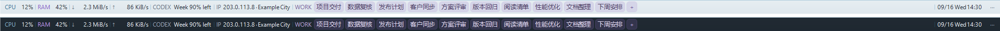

# Taskbar System Monitor 3.7.0 · 信息工作台

把任务栏上方的一行变成可配置的工作信息栏：系统资源、Codex 额度、网络信息、工作追踪和时间。关键词点击即记；Codex 和 IP 只显示信息，不做按钮。



上图为代码渲染的**示例**，不包含真实工作项或 IP。程序未连接数据源时会明确显示状态，不拿示例数据填充实时信息。

## 模块

| 模块 | 常驻信息 | 点击后 |
| --- | --- | --- |
| CPU / 内存 / 上传 / 下载 | 本机实时统计 | 资源面板与历史 |
| Codex | 实际额度窗口的剩余比例 | 纯文本，不响应左键 |
| IP / 位置 | 默认仅本地 IP；经用户启用后可显示公网出口与大致位置 | 纯文本，不响应左键 |
| 工作追踪 | 可点击的关键词、`+N` 列表入口、`+` 快速输入 | 直接打开对应笔记，编辑后自动保存 |
| 日期 / 时间 / 电量 | 可选基础信息 | 资源面板 |

右键信息栏只显示轻量菜单（Work notes / Resource details / Settings…），选择 Settings 才打开设置；左键点击末尾 `···` 仍可直达设置。菜单随明暗主题配色。新版设置采用中性色侧栏、分组卡片和固定底部预览，分为“常规与显示 / 外观 / 数据连接 / 工作追踪”四页，长内容可以滚动。可以启用 / 隐藏模块、上下排序、修改字号、高度、对齐与采样间隔。

横条内置文字统一为英文：CPU / RAM / MEM / BAT / CODEX / IP / WORK，额度如 `5h 77% left · Week 90% left`，日期如 `09/16 Wed 14:30`；电池接电显示 `AC`、充电显示 `AC+`，无电池为 `N/A`。数字使用小数点，不随系统语言变化。用户自定义的关键词保持原样，设置和笔记界面仍为中文。

Codex 和 IP 不显示按钮底色、悬停高亮或手形光标；左键不会弹出窗口，也不会误打开资源面板。自动刷新不变，连接配置仍在设置 → 数据连接，命令行详情入口保留。

## 关键词工作追踪

每项只需要一个**关键词**，不再设置状态或进度。横条只展示关键词；笔记和关联链接是可选详情。

- 点击横条某个关键词，直接打开对应笔记并定位光标；**按住关键词左右拖动可直接排序**，插入线指示落点，松开后自动保存，拖出工作区则取消。拖动不会误开笔记，数据刷新不会让落点漂移；折叠项仍可通过 `+N` 进入列表排序。点击 `+` 进入快速输入。窗口在点击位置附近、工作区底部展开，`Esc` 收起。
- 独立工作窗口改为约 **420 × 242 逻辑像素**的单栏小面板，移除大标题和常驻侧栏；“列表”切换搜索 / 新建 / 排序，点击关键词回到笔记。列表每行左侧有拖动抓手，也可按住整行上下拖动；显示插入线，边缘可滚动，拖动后仍留在列表。搜索过滤时禁用排序，清空搜索即可恢复。中文使用微软雅黑 UI，浅 / 深色共用中性配色和轻量工具栏，减少嵌套边框，短笔记不显示多余滚动条。
- 笔记按内容适度增高，超过上限滚动；“链接”按需展开编辑框，已有合法链接仍可通过标题旁的 `↗` 一次打开。拖动左上角标题可移动面板，松开后限制在当前屏幕工作区内。
- 展开 / 调整高度使用约 150 ms 的淡入和缓动，收起约 110 ms；跟随 Windows 客户区动画开关，高对比度和远程桌面也不播放动画，不修改系统设置。
- 默认点到其他窗口会先保存再收起；需要保持可见时点击“固定”（仅当前面板会话有效），**固定不代表置顶**。点关闭或 Esc 仍可收起，程序切换设置 / 正常退出时同步保存并关闭，不等待动画。
- 关键词按实际宽度依次显示，不限于 3 项；所有项放得下时不会预留 `+N` 而提前折叠，只有宽度不足才显示剩余数量。很长的单个关键词省略显示，悬停可看完整名称；点击仍进入原项。
- 输入框同时用于搜索和新建。输入名称后按 Enter 即创建，并自动进入笔记；已有同名关键词则直接打开，不重复添加。最多 30 项，Enter 才确认新建，未提交的搜索文字不作为工作项保存。
- 停止输入约 650 ms 后自动保存到本机，窗口底部显示保存结果。关闭窗口、切换到设置、正常退出会先立即写入，不再弹保存确认。`Ctrl+S` / `Ctrl+Enter` 可立即保存；`Ctrl+N` / `Ctrl+F` 回到输入框。
- 拖动列表项即可排序，也可使用箭头按钮。筛选时暂不允许排序，清空搜索后可调整全局顺序。
- 笔记详情右下角可直接“删除”当前项，无需返回列表或二次确认；有删除历史时旁边显示“撤销”，可恢复关键词、笔记、链接及位置。删除最后一项自动回到快速输入，列表底部仍可撤销。当前应用会话内最多保留 30 次移除记录，关闭工作窗口后仍可撤销，退出程序后不保留撤销历史。
- 保存失败会保留内容、提供重试，并阻止关闭窗口丢失草稿。空关键词重命名需补全；未完成或无效链接可先作为文字保存，但不能执行，只有合法 http / https 链接可以点开。自动保存保留笔记缩进和空行，不抢走输入焦点。系统强制结束进程不保证保留最后尚未写入的内容。
- 设置 → 工作追踪复用同一编辑器，通过设置窗口底部“保存更改”统一保存；取消设置不会修改原数据。
- 原工作标题自动迁移为关键词，保留全部笔记和链接；旧状态 / 进度字段移除，原来标为“完成”的项也不再隐藏。旧版 EXE 不理解新的关键词配置，不建议用旧版编辑它。

## 一行空间与外观

- 使用 Windows Shell AppBar 正式接口，在**主屏幕底部、任务栏上方预留一整行**。不是嵌入原任务栏；桌面可用高度会减少这一行。
- 默认 24 逻辑像素，125% 缩放时是 30 实际像素；9 pt 常规字体。可选 24 / 28 / 32 高度、8–11 pt 字号。
- 模块内边距为 5 逻辑像素，标签间隔 4、关键词间隔 3；保留原字号和栏高。Codex / IP 按内容紧凑显示，不参与平均拉伸；剩余宽度全部交给工作关键词。关键词背景跟随实际内容，不延伸成空白色块。
- “利用整行宽度”打开时，工作区可使用整行余量；关闭时按内容所需宽度布局，同样不会硬限制关键词数量。较窄屏幕折叠放不下的模块，末尾 `+N` 表示模块数量，与工作区内的关键词 `+N` 分开。
- 跟随系统明暗与强调色，也可选择雾蓝、淡紫、青玉。使用低饱和背景、细分隔和悬停色块，与任务栏保持色彩呼应。
- WORK 使用独立的低饱和灰紫色圆角标签、细边框和同色文字，适配浅 / 深背景；悬停只突出当前关键词，不让整块 WORK 区域一起变色。高对比度模式使用系统颜色，不增加横条高度或标签间距。
- 背景完整重绘、不透明，不截取屏幕底色，不裁剪 / 移动 Explorer 的应用按钮。
- 隐藏 / 正常退出释放预留空间；仅托盘模式下重复启动仍能打开面板。
- **默认不置顶**，允许普通窗口覆盖信息栏。可在“常规与显示”选择“保持在普通窗口上方”；全屏时让位，退出全屏仍尊重该开关，不会偷偷恢复置顶。

## 数据连接

### Codex

每 5 分钟启动一个短暂的本地 `codex app-server --stdio`，完成初始化后只调用 `account/rateLimits/read`，随后关闭私有子进程。自动寻找 `codex.exe`，也可在设置指定路径。

使用 **CLI 当前登录的 ChatGPT 账户**。如果它与桌面应用登录不同，显示的额度也可能不同；API-key-only 登录可能没有 ChatGPT 额度。程序不直接打开登录令牌文件，不创建任务，不调用重置额度、登录、退出登录或消费类接口。缺失窗口不显示为 100%；按服务端的 `windowDurationMins` 标注窗口。

接口依据：[官方 App Server 文档](https://learn.chatgpt.com/docs/app-server)。

### IP 和大致位置

默认关闭公网查询，仅从本机网卡读取内网 IP。设置中明确开启后，每 10 分钟通过 HTTPS 请求 `ipwho.is`；该第三方因此获得公网出口 IP，并返回大致城市 / 网络位置。**不是 GPS 定位**，代理或 VPN 会改变结果。不会发送工作笔记或 Codex 数据。

关闭查询时不调用该服务；网络失败时保留本地 IP 并显示失败说明。服务能力和限制以 [供应商文档](https://ipwhois.io/documentation) 为准。

## 从旧版升级

3.2.0 已移除飞书 / CalDAV 日历：不再显示日程模块，不再保存连接凭据，也没有后台同步或日历诊断入口。首次启动会从本程序的 `settings.xml` 及残留写入临时文件中移除旧日历节点（服务器、账号、加密密码）与模块项，不备份这些凭据；其他设置和工作项不变。清理失败会提示，不影响日历功能保持禁用。

这只清理本机配置，**不会删除飞书中的任何日程，也不会撤销飞书端的专用密码**。若不再供其他软件使用，可自行在飞书撤销该凭据。旧日历账号不会传给其他服务。

## 安装

要求 Windows 10 / 11、.NET Framework 4.8。使用当前用户的普通权限，不存储 Windows 密码；企业策略禁止创建计划任务时会明确报错。

```powershell
Set-ExecutionPolicy -Scope Process Bypass
.\install.ps1
```

安装到 **`%USERPROFILE%\.local\TaskbarSystemMonitor`**，程序与配置不依赖 Codex 的安装位置或应用私有缓存。先构建和自检，再安全退出旧实例，校验复制、保留上一份 EXE，最后由 Windows 任务计划程序直接启动。失败会尝试恢复上一份 EXE；脚本不强杀正式监控器或 Explorer。

3.7.0 首次升级会把安装环境可见的旧 `%LOCALAPPDATA%\TaskbarSystemMonitor\settings.xml` 原样复制到新目录，校验 SHA-256，保留旧副本。新目录已有配置时绝不覆盖。不要再用旧 EXE 编辑旧副本，它们不会双向同步。

### 独立常驻

- 登录 Windows 桌面后约 5 秒自动启动，不需要打开 Codex、浏览器或终端。关闭 Codex 不负责停止本程序；正常运行时只有监控器 EXE，没有常驻 PowerShell 包装脚本。
- 每用户一个 `TaskbarSystemMonitor-<用户标识摘要>` 计划任务，交互式登录、最低权限、不保存密码。重复启动不创建第二份实例。
- 无执行时间上限，接入 / 拔掉电源都不停止，不要求联网或空闲。Windows 睡眠时程序随系统暂停，唤醒后继续；注销 / 关机结束当前会话，下次登录自动启动。
- 异常非零退出由 Windows 每分钟重试，最多 3 次；手动“退出”或 `stop.ps1` 正常结束，不会被强行拉回。若持续崩溃，请看安装目录的 `error.log`，不要依赖无限重启。
- 托盘“开机自动启动”开关控制同一个任务的登录触发器；关闭自启不影响手动 `start.ps1`。安装脚本会启用登录自启。
- 系统资源、IP 和笔记不依赖 Codex。仅额度模块需要可用的 Codex CLI 和登录状态；读取失败显示 Unavailable，不影响其他功能。

这些策略使用 Windows 的[交互式登录任务](https://learn.microsoft.com/en-us/windows/win32/taskschd/starting-an-executable-when-a-user-logs-on)与[执行时间设置](https://learn.microsoft.com/en-us/windows/win32/taskschd/tasksettings-executiontimelimit)，不尝试把有界面的程序装成后台系统服务。

```powershell
.\start.ps1           # 通过 Windows 独立启动；已有实例则保持
.\start.ps1 -Restart  # 先保存笔记，再安全重启
.\stop.ps1            # 保存并退出，不取消下次登录自启
.\status.ps1          # 查看版本、PID、自启、任务状态和运行限制
```

```powershell
# 只构建、便携运行
.\build.ps1
.\dist\TaskbarSystemMonitor.exe
# 定位某个模块；已有实例时不会重复启动
.\dist\TaskbarSystemMonitor.exe --module=Codex
# 可选：Ip、Tracks、Settings
```

直接启动 `dist` 仅用于开发 / 便携运行；需要长期常驻请运行 `install.ps1`，不要依赖从开发终端拉起的实例。首次便携运行会登记当前位置的登录任务，移动 EXE 后需重新安装或重新启用自启。配置与工作项统一位于 `%USERPROFILE%\.local\TaskbarSystemMonitor\settings.xml`，请不要上传真实配置。

脚本职责、失败处理与代码边界见 [架构说明](docs/architecture.md)。

## 验证与边界

```powershell
.\test.ps1
# 退出正在运行的监控器后，在真实 Explorer 桌面执行：
.\test.ps1 -Desktop
# 使用空白临时配置打开设置界面，不保存真实配置：
.\dist\TaskbarSystemMonitor.exe --settings-test=dist\settings-test.txt
# 使用内存中的示例工作项检查界面，不写入实际配置：
.\dist\TaskbarSystemMonitor.exe --work-test=dist\work-ui-test.txt
# 深色示例：追加 --dark；设置页示例：--settings-test=dist\settings-test.txt --work-sample
```

测试覆盖采样、108 组 DPI / 排版组合、288 组关键词点击 / 折叠 / 恰好放满边界、12 组模块紧凑布局、小面板动态高度 / 链接展开 / 动画曲线 / 屏幕边界、额度计算、关键词迁移、快速输入 / 同名选择、搜索 / 排序 / 数量上限、定时合并自动保存、关闭前立即写入、保存失败保留草稿、移除撤销、笔记缩进与换行、旧日历配置清理、迁移幂等性、HTTPS 跳转与链接限制。桌面测试验证最大化窗口不进入信息栏、反复定位无漂移、改高度、隐藏再显示和退出恢复，并检查真实窗口置顶样式、模拟全屏恢复、面板动画结束后的尺寸与输入焦点，以及点到其他窗口后保存并收起。

实际验证与未测范围见 [验证记录](docs/validation.md)。目前仅在主屏底部显示；不支持多屏各放一条、硬件温度、GPU 或逐进程网速。对话框首次按所在屏 DPI 缩放，运行中跨屏改变 DPI 尚未验证。公网位置请求未完成实机端到端验证。

## 卸载和隐私

```powershell
.\uninstall.ps1
# 同时删除本程序配置 / 工作项 / 错误日志：
.\uninstall.ps1 -PurgeSettings
```

默认保留新目录的设置，只删除已安装的本程序 EXE、升级备份和当前用户的计划任务 / 旧自启项；不递归删除其他文件。升级前的旧 AppData 副本仍保留，`-PurgeSettings` 仅清理当前新安装目录。工作项始终只保存在本机。外部数据源仅在相应模块和连接选项启用时读取；无广告、无遥测。

源码在 `src/`，Windows 自带 C# 编译器可构建。GitHub Actions 提供自检与 EXE 工件。采用 [MIT](LICENSE) 许可证。
